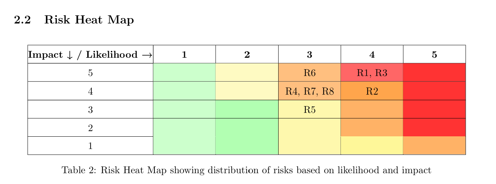
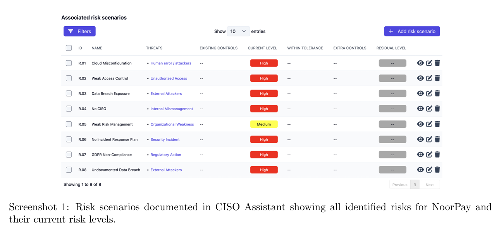
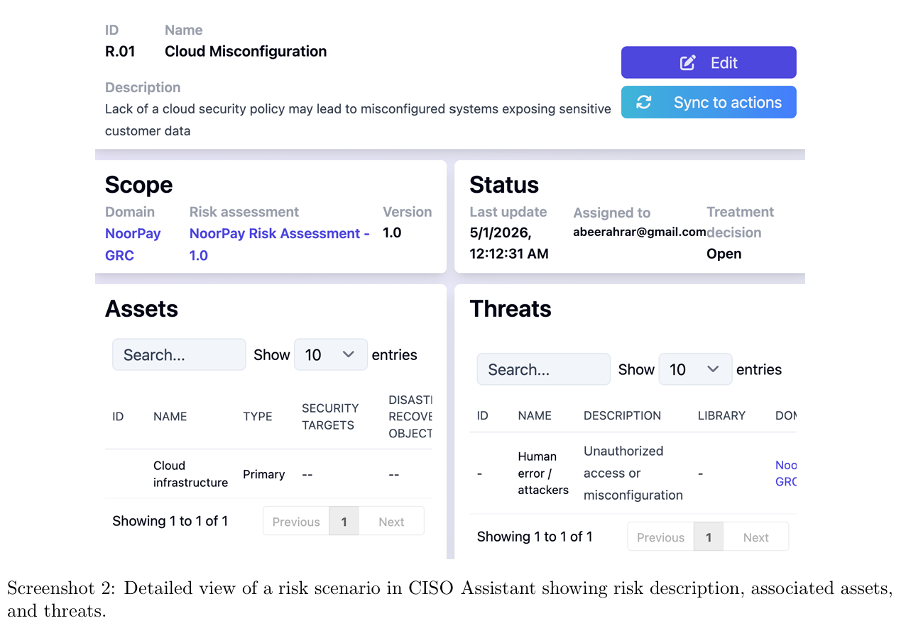
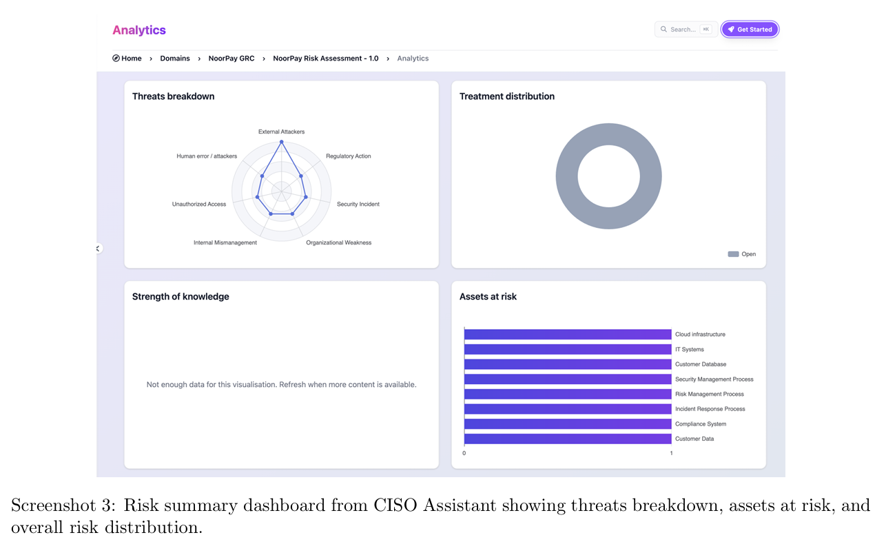
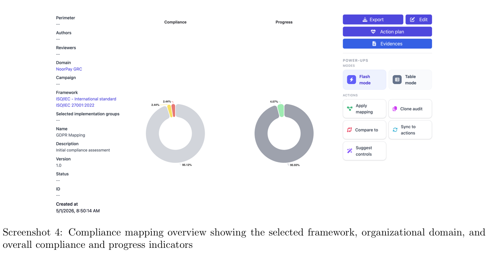
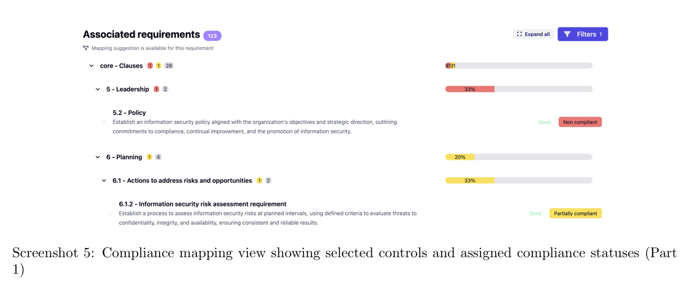
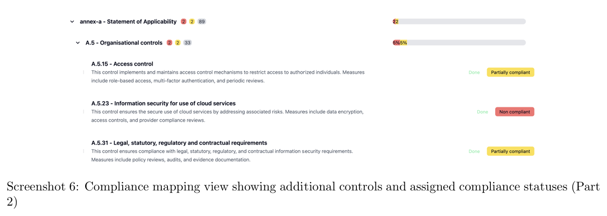

# NoorPay GRC Assessment - Cybersecurity Risk & Compliance Project

**Course:** CS3178 - Governance, Risk & Compliance in Cybersecurity (Spring 2026)  
**Instructor:** Dr. Sohail Khan  
**Team:**  [Abeer Hussain](https://github.com/abeerahrar), Sarah Eid, Nancy Elhaddad  
**Institution:** Effat University, College of Engineering, Jeddah, Saudi Arabia

---

## Executive Summary

NoorPay, a payment processing company, was evaluated for cybersecurity risks and compliance with **GDPR** and **Saudi PDPL**. The assessment revealed:

| Category | Key Findings |
|----------|---------------|
| 🔴 Top Risks | Data breach exposure (R3), Cloud misconfiguration (R1), No incident response plan (R6) |
| ⚠️ Compliance Status | Non-compliant with 10+ requirements across both frameworks |
| 📊 Past Incident | 12,000 customer records breached - never documented or reported |
| ✅ Priority Actions | Breach notification procedure, Security leadership (CISO), Incident response plan |

📄 **[Download Full Report](docs/CS3178FinalReport.pdf)**

---

## Risk Heat Map

Distribution of 8 identified risks based on likelihood and impact:


*(Visual representation from report - risks R1, R3, R6 in high-risk zone)*

### Top 3 Critical Risks

| Risk ID | Description | Rating |
|---------|-------------|--------|
| **R3** | Data breach exposure - sensitive financial data at risk | 🔴 HIGH (20) |
| **R1** | Cloud misconfiguration - no cloud security policy | 🔴 HIGH (20) |
| **R6** | No incident response plan - delayed breach response | 🔴 HIGH (15) |

📊 **[View Full Risk Register (CSV)](Table 3_ GDPR and PDPL Compliance Gap Analysis Showing Compliance Status, Evidence from the Scenario, and Key Gaps - Sheet1.csv)**

---

## Compliance Gap Analysis (GDPR & PDPL)

**Compliance Status Summary:**

| Framework | Compliant | Partially Compliant | Non-Compliant |
|-----------|-----------|---------------------|---------------|
| GDPR | 0 | 1 | 5 |
| PDPL | 0 | 2 | 4 |

**Critical Gaps Identified:**

1. ❌ **No breach notification process** - 12,000-record breach never reported
2. ❌ **No security leadership (CISO)** - zero accountability for data protection  
3. ❌ **No incident response plan** - cannot detect/respond to attacks

📊 **[View Gap Analysis Table (CSV)](deliverables/gap_analysis_table.csv)**

---

## CISO Assistant Tool Outputs

### Screenshot 1: Risk Scenarios Overview
All identified risks with current risk levels documented in CISO Assistant



### Screenshot 2: Detailed Risk View
Risk description, associated assets, and threat information



### Screenshot 3: Risk Dashboard
Threats breakdown, assets at risk, and overall risk distribution



### Screenshot 4: Compliance Mapping Overview
Framework selection, organizational domain, and compliance progress



### Screenshot 5: Compliance Controls (Part 1)
Selected controls with assigned compliance statuses



### Screenshot 6: Compliance Controls (Part 2)
Additional controls showing compliance status



---

## Incident Response Plan Highlights

### Response Team Structure

| Role | Responsibilities |
|------|------------------|
| **IT Manager** (Incident Lead) | Coordinates technical actions, containment decisions |
| **Compliance Officer** | GDPR/PDPL reporting, regulator communication |
| **Customer Support Lead** | Affected customer communication |
| **External Legal Counsel** | Legal advice on breach obligations |

### Detection Indicators (IoCs)
- Unusual login activity (failed attempts, unfamiliar locations)
- Anomalous data access patterns
- System performance degradation

### Recommended Remediation Timeline

| Priority | Action | Timeline |
|----------|--------|----------|
| 🔴 Immediate | Establish breach notification procedure | 0-1 month |
| 🔴 Immediate | Develop incident response plan | 0-1 month |
| 🟡 Short-term | Assign security leadership (acting CISO) | 1-3 months |

---

## References

- NIST SP 800-61 Rev. 2 - Computer Security Incident Handling Guide
- EU General Data Protection Regulation (GDPR) 2016
- Saudi PDPL (SDAIA) 2021
- ISO/IEC 27001:2022
- CISO Assistant Tool (2026)

---

```

## Repository Contents
├── README.md # This file
├── docs/CS3178FinalReport.pdf # Complete project submission
├── deliverables/
│ ├── risk_register.csv # 8 risks with scores/ratings
│ └── gap_analysis_table.csv # GDPR/PDPL gap analysis
└── screenshots/ # 6 CISO Assistant screenshots 

```

*Spring 2026 - Effat University*
