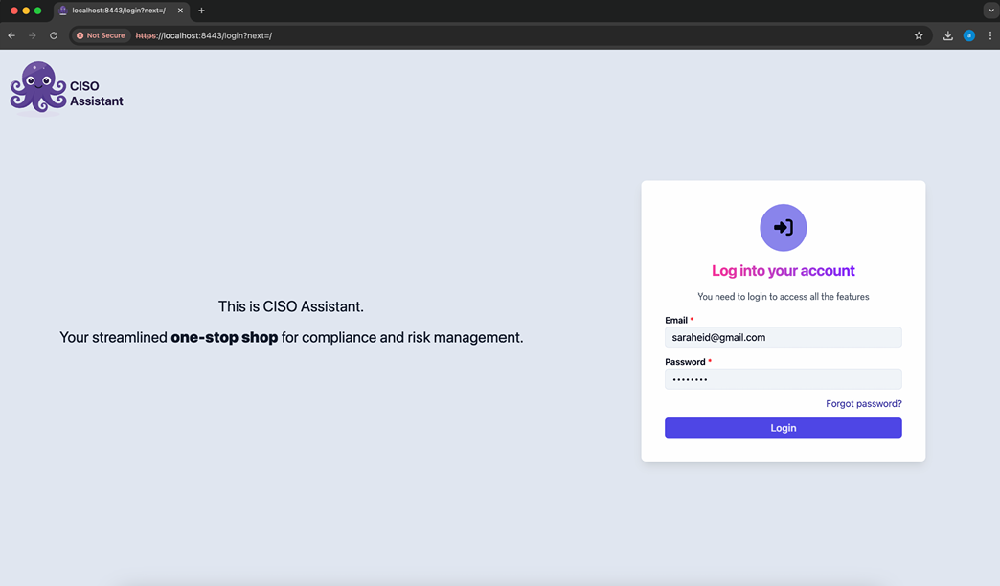
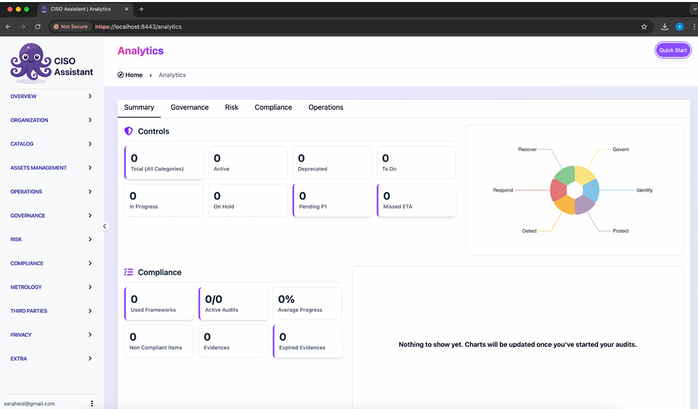
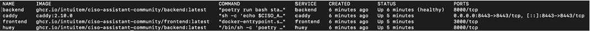

## Course Title: Governance, risk & compliance Course #: CS 3178

| **CS 3178** | **Governance, Risk & Compliance** | **Lab02** | **Spring 2026** |
| ----------- | --------------------------------- | --------- | --------------- |
| Name:       | Sarah Eid                         |           |                 |
| Student ID: | S22107757                         | Section:  | 1               |

**Lab02 - Install a GRC platform (CISO Assistant Community)**

**Task 1: installation evidence**

Provide the following evidence from your setup:

1. Screenshot: browser showing the login page (URL visible)

2. Screenshot: after login (first page after login)

3. Screenshot or copy/paste output: docker compose ps

---

**Task 2: reflection**

**Short reflection (6–8 lines):**

In this lab, Docker assisted in the deployment of the CISO Assistant platform by running all required components inside containers without any need to manually configure them. It guarantees that all components of the frontend, backend, database, and proxy are working together properly on the local machine. Docker runs multiple services because each service has its own responsibility, such as handling data, processing application logic, and handling web traffic. In a real-world scenario, problems such as port conflicts, certificate issues, and RAM availability might cause problems with the containers not working properly.
